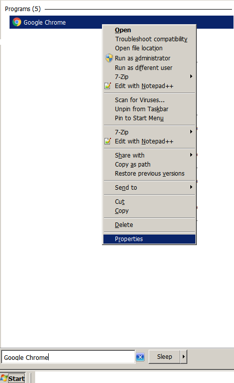
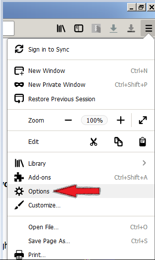
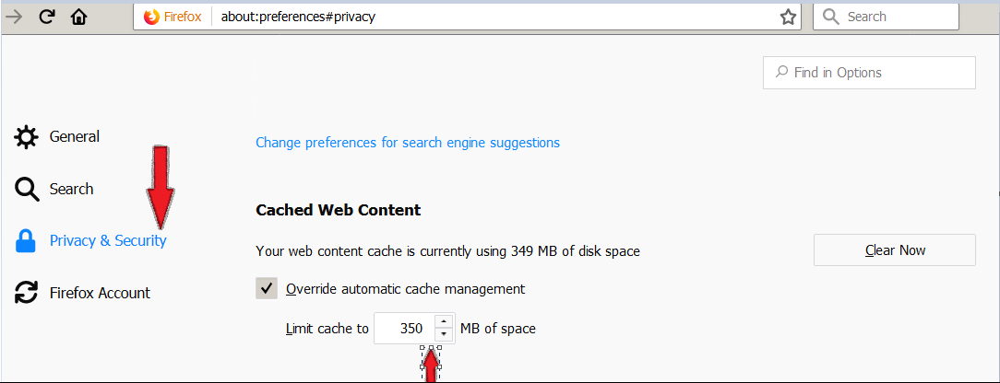
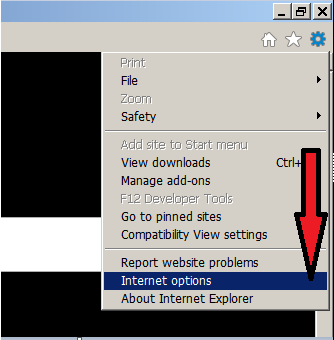
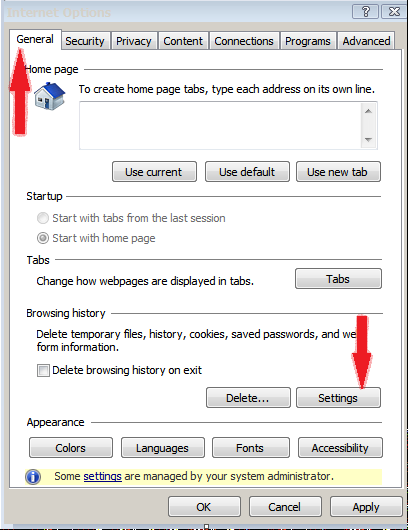
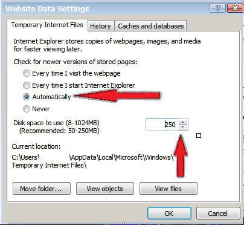

# How to Change HTTP Browser Cache Size

HTTP Caching is available in most of the browsers and helps make a website more responsive and reduce network bandwidth.  In this article, we will understand how to increase or decrease the Cache size in Modern browsers like Google Chrome, Mozilla Firefox, IE.

## Why to increase HTTP Cache Size

There are plethora of benefits of using the Browsers HTTP Caching. *Caching would be useless if it did not significantly improve performance.* Following list few of the caching benefits.

### 1. Increased Performance

The performance of web sites can be significantly improved by reusing previously fetched resources. Web caches reduce latency and enable the content to be loaded quickly. This reduces the page load time and hence make the website more responsive.

### 2. Reduce Network Cost

The goal of HTTP caching is to eliminate the need to send requests in many cases, thereby reducing the network traffic by reducing the number of round-trips. Also, in certain condition, it can eliminate the need to send full responses and saves network bandwidth.

### 3. Offline Access

In Certain instances, the users may experience disruption in the network or No network access. In these scenario's,website may cache the content, thereby allowing the content to be served locally with limited internet connectivity. This works well for sites with static data which doesn't change frequently like Websites containing documentation.

## How to Increase Http Cache Size in Browsers

Different browsers provide various ways to increase the HTTP Cache size. This document is a step by step guide to increase the Browser Cache in various Browsers (Chrome, Firefox, IE).

## Increase Cache Size in Chrome
Currently, the Chrome Browser doesn't provide a way to set the Max Size of HTTP Cache in the UI. However, we can add a parameter **(disk-cache-size)**, using command line. 

1. Open the Google Chrome Executable properties. Type Google Chrome in  the Search Programs in the Start menu.

2. Right click on the properties of the Google Chrome Executable and open the Shortcut tab.

3. Add the parameter --disk-cache-size=52428800
The entered size is in MB. So, 52428800 bytes is equivalent to 50 MB.

4. Press **Ok** or **Apply** and launch the Google Chrome.

## Increase Cache Size in Mozilla Firefox

1. Launch the Firefox.

2. Go to Tools -> options.

3. Select Privacy and Security options in the left side.

4. Scroll down to Cached Web Content section. You would be able to see the current cache size. For e.g. on my machine The text is Your web content cache is currently using 349 MB of disc space.

5. Check the Override automatic cache management Checkbox.

6. Enter the value in the textbox next to Limit Cache to.  The entered  value is calculated as Mb unit.

## Increase Cache size in Internet Explorer (IE)

1. Launch the internet explorer.

2. Go to Tools -> Internet options.

3. Next, in General Tab, Under Browser History, Click Settings button.

4. Above step would open up a new Dialog, On Temporary Internet files tab, select the Automatically radio button under the Check for new version Of stored pages.

5. Next, set the desired value of the Disk Space to use in the textbox. The entered  value is calculated as Mb unit.

6. Click Ok and then again Ok/Apply and settings would be saved.

7. Close IE and open again.