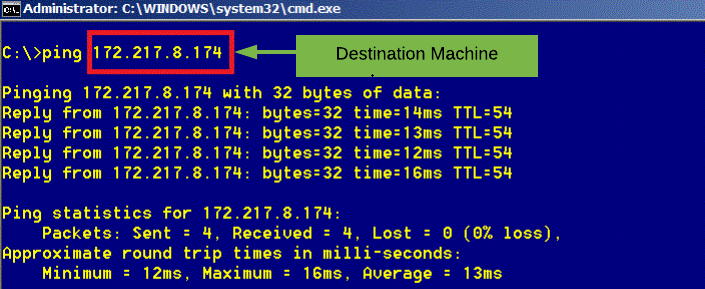
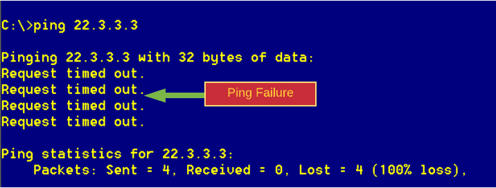
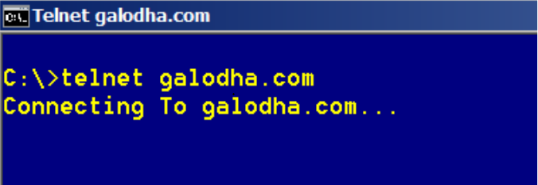
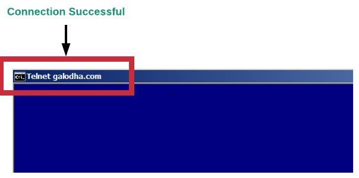

 # Various ways to verify the Connectivity from Client to Server

Most of the code I write, involves connectivity from one machine to another remote machine. For e.g. While working on a Frontend application, it needs to communcate with Another API. It's utmost important to understand if the connectivity exists between the two machines and the port for the destination machine is open and accessible. In this article, I will explore few technique to test the network connectivity with another machine & Port number. You might find these helpful in case you need to verify the connectivity to remote machines.

***

### What are various Steps to verify Connectivity?

1. The first step in this process is to verify the **Network** connectivity with the remote machine. It means that we are able to send packets to the remote machine.

2. Next, Verify the Connectivity to the Destination port to check if the port is blocked or inaccessible. This ensures that the firewall is not blocking the port. 

[TBD]Diagram

## Check Connectivity between machines using Ping

The old good friend, "Ping". Using the **Ping** command, we can verify the network level connectivity between client and Remote Machine.
*At the N/w level Ping rely on ICMP, which is at layer 3, hence it doesn't check if a port is open or not.*
So, it is possible that ping works but still the call to API on destination machine doesn't work.

### How to use ping

1. Open command prompt.
2. Enter ping command, passing the destination machine machine IP or Host name as shown below

```
ping 34.45.5.6
```

### Successfull Response

If Ping Succeeds, we will get a reply from destination machine. This ensures that the connectivity exists between source and destination machines. Following image displays the result of a successful ping response.



### Failure Response

If ping results in a **"Request timed out."** message, then there is a connectivity issue from Source to destination.



***

## Check Connectivity between machines Using Telnet

Wikipedia defines Telnet as 
>"Telnet is a protocol used on the Internet or local area networks to provide a bidirectional interactive text-oriented communication facility using a virtual terminal connection.". At N/w level, Telnet works in the Application layer and needs the ports connectivity.

Telnet gets its name from Terminal Network. With Telnet, we can establish a host session to a server. The advantage of using Telnet is that we can verify the connectivity to a port as well.

### Why Telnet is not preffered?

Telnet uses plain text for communication and hence not encrypted. Therefore, in Windows, by default the TelNet Client is disabled. Telnet can be enabled in windows by Adding/Removing windows component using Control Panel.


### How to use Telnet

1. Enter command prompt.
2. Use telnet command passing in the Destination Server Name/Address and the port number. e.g. telnet destination 80. 

**Note:** The default port for telnet is 23. So, if we omit the port number in telnet command, the  Telnet will try to connect to the destination using port 23.

### Telnet succeeds

After entering the telnet command, we will see the text *"Connecting to HostName..."* as shown in below image.



If the connection succeds, We will see a blank screen. Notice the Title of the console window. It should read Telnet <DestinationName>



### Telnet Failure


If the destination Machine or the port is inaccesible, we will get the error *"Could not open connection to the host, on port 80: Connection failed"*

***

## Check Connectivity between machines using Powershell
My most preffered option, It is powerful as It allows to explore all the potential of .net framework as we can call any method of the .net framework using powershell.

### Option 1 - Test-NetConnectioncommand

If you're running Windows 8/Windows Server 2012 or newer, you can use the Test-NetConnectioncommand.

The Test-NetConnection cmdlet displays diagnostic information for a connection. It supports ping test, TCP test, route tracing, and route selection diagnostics. Depending on the input parameters, the output can include the DNS lookup results, a list of IP interfaces, IPsec rules, route/source address selection results, and/or confirmation of connection establishment. For our purpose, we are going to use the cmdlet with destination name and the port number

**Usage**
```
Test-NetConnection -Port 53 -ComputerName LON-DC1
```

**Output**

```
PS C:\> Test-NetConnection -ComputerName "www.contoso.com" -InformationLevel "Detailed"
PingReplyDetails (RTT) : 164 ms
ComputerName           : www.contoso.com
RemoteAddress          : 65.55.39.10
NameResolutionResults  : 65.55.39.10
64.4.6.100
InterfaceAlias         : Ethernet
SourceAddress          : 10.137.193.122
NetRoute (NextHop)     : 10.137.192.1
PingSucceeded          : True
PingReplyDetails (RTT) : 164 ms
```

### Option 2 - System.Net.Sockets.TcpClient

Another option using powershell is making use of the built in `TcpClient` class. This class has a constructor which takes in the Destination Server Name and the Port number.This constructor creates a new TcpClient and makes a synchronous connection attempt to the provided host name and port number. `TcpClient` will block until it either connects or fails. This constructor allows you to initialize, resolve the DNS host name, and connect in one convenient step.

**Usage**

```
New-Object Net.Sockets.TcpClient "10.45.23.109", 443 
```

***

## Summary
In this article, we explored 3 techniques to verify the connectivity to destination machine and the port number. We looked at the Ping, Telnet and powershell commands to verify the connectivity. These technique are mostly supported on Windows Operating System.

• Most of the time a firewall is blocking the traffic. This firewall can either be on your local machine or on the server. Check both ends for a firewall. If the actual server is on a different network, for example across the Internet, there could be other firewalls in the middle.
	• The server process is NOT running. Ensure the server is running